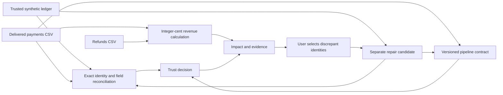

# Where did the revenue go?

An interactive, reproducible data incident—not a prerecorded animation. Generate a delivery, inspect the checks, and verify a repair against an explicitly trusted synthetic reference. Every button runs local Python code against content-addressed CSV sources.

## The 60-second walkthrough

Start `python3 server.py` and open http://127.0.0.1:8765/#incident-workflow. No installation beyond Python 3.9+ is needed.

1. Keep seed **17** and **Omit the East region** selected. Click **Replay delivery**.
2. The trusted reference net is **$1,476**. The incomplete delivery shows **$976**. The missing **$500** is a data discrepancy, not an inferred business decline.
3. Click **02 · Inspect the evidence**. The column/type/key gate **passes**, but reconciliation fails: **PAY-001 through PAY-004** are missing. Expand an identity to see its reference record and original CSV record number.
4. Click **03 · Test a repair**. Select only PAY-001 and build a candidate. It remains untrusted: three missing identities are unresolved.
5. Return to the original delivery, select all discrepancies, and build another candidate. It passes both checks. Open **01 · Follow the impact** to see the restored **$1,476** and zero difference.
6. Download the evidence bundle. It includes the original delivery, reference, refunds, candidate CSV, SHA-256 fingerprints, exact transformation log, pipeline validation report and both incident reports.

Try the duplicate-retry and ×100 amount failures together. Remove all failures to run a healthy control. Change the seed to vary legitimate payment amounts. A different revenue total is not itself a failure.

## Architecture



Sources use the existing SHA-256 dataset store. The replay uses the actual CSV pipeline validator, including duplicate-key quarantine; it does not substitute a simulated success badge. The reference reconciliation independently reads the rows and does not consult the injected fault labels. Those labels are retained solely for replay provenance and fixture evaluation.

`incidents.py` owns scenario generation, reconciliation, integer-cent metrics, candidate transforms and immutable reports. `dist/incidents.js` renders metric dependencies, record evidence and repair controls. The server exposes local same-origin endpoints; the existing host/origin restrictions remain in force.

## Exact semantics

- One **synthetic snapshot** with 12 completed USD payments and two USD refunds. Both sides represent the same snapshot. This is not a previous-day comparison, time-series detector or general ledger implementation.
- Each payment has a unique ID, order ID, region, currency and integer amount in cents. Orders are identity references, not a separate order-validation workflow in this demo.
- Demo net revenue = all payment cents minus all refund cents. Refunds remain in the period even when the corresponding payment is missing from the delivery. This cash-based demonstration is not an accounting standard.
- The untrusted metric intentionally counts every delivered payment, including duplicate occurrences. It illustrates what an unchecked dashboard would show; it is never represented as approved revenue.
- The **reference is assumed independently trusted and complete for this exact snapshot**. In a real integration, matching a reference is only useful if its authority, scope, freshness and completeness have been established. The fixture generator supplies both files here; this is clearly a sandbox, not independent production evidence.
- Reconciliation compares every field by exact payment identity. Same total does not mean same records: offsetting errors still fail. Row order is irrelevant. The current fixture supports missing, duplicate and changed identities; unexpected identities or invalid references are outside the scenario and rejected.
- A candidate replaces **all occurrences of explicitly selected identities** with their exact reference record. Unselected rows retain their order and values; replacement records are appended in sorted identity order. Original CSVs are never rewritten. The log retains original record positions and before/after values.
- Candidates must pass the pipeline gate **and** have zero reference discrepancies. They are saved but **not published**. Each candidate starts from the original delivery; candidates cannot be chained.
- Run identity hashes the engine version, source identities, validation identity, calculations, evidence and transformations. Replaying identical inputs reuses the report. SQLite triggers prevent ordinary report updates/deletes; a local database owner can still alter the schema. No cryptographic authenticity or tamper-proof storage claim.
- Saved history shows the latest 50 runs. All reports remain retrievable by their ID. There are no live model calls, hosted users or automated business-data repairs.

## Reproduce without the browser

```sh
# Save and export a missing-region incident to JSON:
python3 incidents.py --seed 17 --fault missing_region > incident.json

# Combine all three failures:
python3 incidents.py --seed 17 --fault missing_region --fault duplicate_retry --fault amount_unit > combined-incident.json

# Evaluate every failure combination across three fixed seeds:
python3 incidents.py --evaluate > evaluation.json
```

Use `python` on Windows. These commands use the normal local state directory; set `RECEIPT_DESK_STATE` to a temporary directory to keep an evaluation separate from your working data. JSON output contains synthetic source records. A failed evaluation exits with code 1.

API sequence:

- `POST /api/incident-simulate` with `{"seed":17,"faults":["missing_region"]}`. Use `[]` for a healthy control. Seeds must be integers 0–999999.
- `POST /api/incident-repair` with `{"incident_id":"<delivery run ID>","payment_ids":["PAY-001"]}`.
- `GET /api/incident/<run ID>`, `/api/incident-bundle/<run ID>`, and `/api/incidents` retrieve saved results, a portable bundle and compact history.

Every POST requires `Content-Type: application/json` and the local origin rules of the existing server.

## What the evaluation proves—and what it does not

The committed [fixture evaluation](incident-evaluation.json) exercises 3 seeds × 8 failure combinations = **24 cases**. All selected repairs are revalidated, and detected identity sets must equal the known corrupted identities.

| Check | Broken deliveries detected / 21 | Healthy deliveries flagged / 3 |
|---|---:|---:|
| Column/type/key gate | 12 | 0 |
| Gate plus exact reference reconciliation | 21 | 0 |

The nine misses by the schema gate are deliberately schema-valid omissions and amount changes. Reconciliation can detect them because it has the matching trusted reference. This is **fixture coverage**, not an estimate of production precision or recall, a held-out statistical benchmark, or evidence that an arbitrary company export can be repaired automatically.

Unit tests also cover partial repairs, immutable originals and reports, concurrent replay, invalid selections, reproducible source hashes, record-level evidence and offsetting amount errors that leave the total unchanged. The HTTP tests cover replay → repair → bundle retrieval. Existing pipeline and business-workflow tests continue to run.

## Next useful extension

Accept user-supplied reference/delivery pairs under an explicit reconciliation contract, with snapshot dates, source authority, unexpected-identity handling and freshness/completeness gates. Evaluate those checks on held-out failure scenarios before attaching model-written explanations. This first replay provides a visible, inspectable foundation for that work.
