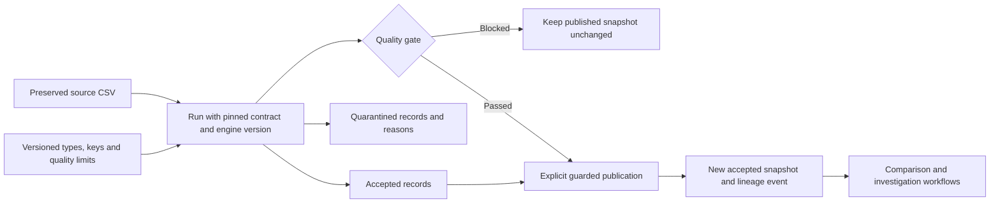

# Reusable CSV pipelines

A one-off quality report can reveal an issue. A pipeline gives every incoming batch the same rules, makes failed rows explainable, and protects the dataset downstream users consume.

Record Desk now provides local **snapshot pipelines**: versioned contracts, deterministic validation, a publication gate, and persistent lineage. This is an in-process Python/SQLite implementation for small CSV batches, not a distributed warehouse or streaming platform. No model or external provider is called.



## Try the browser demo

1. Open **Data pipelines → Load pipeline demo**.
2. Validate the selected `passing.csv`. Expect two accepted rows, zero quarantined, and a passing gate.
3. Click **Publish accepted snapshot**. This publishes a dataset within the local workspace; it does not upload anything to the Internet.
4. Choose `failing.csv` and validate it. Expect three quarantined rows: two repeated IDs and one row with an invalid date and nonnumeric amount. Publication is blocked and the prior snapshot remains current.
5. Re-run either source or reopen its saved result. The same engine, contract and source identify the same run, including its original timestamp. Replays do not publish automatically.

Published accepted snapshots appear in other saved-dataset selectors. Their audit history links to the pipeline run, original source and contract. A domain investigation still requires its own applicable inventory or order contract; generic type validation does not establish business semantics.

## Define a contract

Upload/save a source batch and open **Create or revise a data contract**. Load the source columns, choose a type per column, mark required values, and choose one or more key columns. All fields start as text; types are never inferred. Key fields must be required.

**Edit a copy of pinned rules** loads the selected version into the editor. Saving changed rules under the same pipeline name creates an immutable numbered version. Identical rules reuse their previously stored version, even if it is no longer the latest. This is not a schema rollback: only runs under the latest numbered version can be newly published. A previous published snapshot remains available when rules change.

Contracts can be downloaded as JSON and stored alongside a project's code. [Example contract](../examples/pipelines/contract.json).

| Type | Accepted input | Typed diagnostic JSON |
|---|---|---|
| Text | Exact text, without surrounding whitespace | String |
| Integer | Optional minus sign, at most 15 digits, no leading zeros except zero | Integer |
| Decimal | Optional minus sign, up to 18 integer digits and 9 fractional digits; no exponent, grouping separators, NaN or infinity | Exact decimal string, avoiding binary floating-point rounding |
| Date | Valid Gregorian `YYYY-MM-DD` | ISO date string |
| Boolean | Exactly `true` or `false` | Boolean |
| Optional empty cell | Only an exactly empty, non-required cell | `null` |

No trimming, imputation, locale conversion, date guessing or silent duplicate removal occurs. Use explicit source corrections or the separate whitespace-cleaning workflow. Original source cells are retained alongside typed values.

Headers must match the contract exactly and case-sensitively. Reordered columns are mapped by name; extra, missing or ambiguous columns block the batch. Output columns follow contract order. An added column needs a deliberate contract revision, even if every row otherwise looks valid.

Composite key uniqueness is evaluated **within the current batch**, using parsed values. Thus decimal keys `1.0` and `1.00` collide. Every occurrence is quarantined, including a valid row whose identifiable duplicate has errors in other cells or row width. Text keys remain case-sensitive. This does not check uniqueness across snapshots or against another system.

## Quality gate and publication

The gate requires:

- No schema errors.
- At least the configured minimum number of accepted rows (minimum one).
- Quarantined rows as a percentage of all source data rows at or below the configured maximum.

The default maximum is zero. A nonzero threshold explicitly permits publishing the accepted subset while retaining excluded records in quarantine. Counts and limits are shown with the report. Empty batches cannot pass. The gate cannot detect records omitted by an upstream export, stale data, or values that are correctly typed but factually wrong.

Validation alone never updates the published snapshot. Publication verifies the passing gate and latest contract, then checks the caller's expected current run under a SQLite write transaction. If another publication won the race, the caller must refresh rather than silently overwrite it. Re-publishing the already-current run has no additional effect. Dataset materialization, audit linkage and publication history are committed together; earlier source datasets and events remain available.

A user can deliberately publish a previously validated batch under the latest contract after refreshing the expected current pointer. There is no business-time ordering or automatic freshness policy, so inspect the source before publishing a backfill. Contract, run and publication tables reject ordinary UPDATE/DELETE operations. This is local audit history, not tamper-proof storage; the computer owner can alter the database or schema.

## Outputs and lineage

A validation report contains:

- Source SHA-256 and saved dataset ID.
- Contract ID, version, definition and definition SHA-256.
- Validator version and content-derived execution ID.
- Counts, schema errors, rule errors, gate decision and limits.
- Accepted typed values, exact source cells and source record numbers.
- Quarantined cells with field-specific reasons.

Source record 1 is the header. Multiline quoted CSV cells count as one record.

The diagnostic JSON contains all accepted and quarantined records, even for a blocked run, so engineers can diagnose failures. Accepted CSV export and publication require a passing gate. Quarantine CSV includes each record's raw-cell array and reasons as JSON columns, preserving even malformed row lengths.

Human-facing CSV downloads prefix formula-like cells with an apostrophe for spreadsheet safety; this also protects negative-looking cells. Use diagnostic JSON or stored datasets for exact machine values. Stored accepted snapshots preserve original cell spelling, in contract column order, using standard CSV serialization. Published snapshots are still text CSVs; the contract and diagnostic JSON carry type information.

## CLI for scripts and external orchestration

Run from the repository. All examples below are synthetic. The CLI uses the same state directory as the server (`RECEIPT_DESK_STATE`, or the default local Record Desk directory). Set that variable to the server's directory when sharing its saved contracts and runs.

```sh
python3 pipelines.py contract --name daily-records --spec examples/pipelines/contract.json
```

Copy the returned `id` into `CONTRACT_ID` below:

```sh
python3 pipelines.py run --contract CONTRACT_ID --csv examples/pipelines/passing.csv
python3 pipelines.py run --contract CONTRACT_ID --csv examples/pipelines/failing.csv
python3 pipelines.py list
```

A saved dataset can be used with `--dataset DATASET_ID` instead of `--csv`. The CLI returns compact JSON with execution identity, counts and gate results; it does not print source rows.

Exit codes: **0** for a passing validation or successful command, **2** for a blocked quality gate, **1** for invalid input or publication conflicts. These can be consumed by a shell or external job runner; no scheduler is installed or started by Record Desk.

To explicitly publish a first passing snapshot:

```sh
python3 pipelines.py run --contract CONTRACT_ID --csv examples/pipelines/passing.csv --publish
```

For a replacement, pass the current published run ID shown in the browser's publication panel:

```sh
python3 pipelines.py run --contract CONTRACT_ID --csv next-batch.csv --publish --expected-current CURRENT_RUN_ID
```

A failed gate exits with code 2 and never publishes. A stale expected-current ID or an obsolete contract blocks publication. Reusing an existing run never changes its validation report.

## Scope and next engineering steps

Limits remain UTF-8 CSV, 2 MB, 10,000 data rows, 100 columns, local single-user operation. Each input is a complete snapshot. There are no incremental merges, CDC, object-store connectors, cross-table foreign keys, freshness SLAs, automatic retries, or role-based approvals. Other app workflows can still inspect raw datasets; the publication gate governs pipeline outputs rather than all workspace access.

The next useful additions are source completeness/freshness checks, keyed differences between consecutive snapshots, and a machine-facing current-publication endpoint for downstream jobs. Larger-scale execution should follow measured workload needs. Authentication, tenant isolation and retention controls remain prerequisites for a hosted service.
